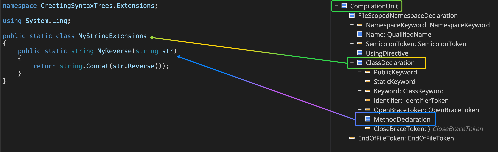
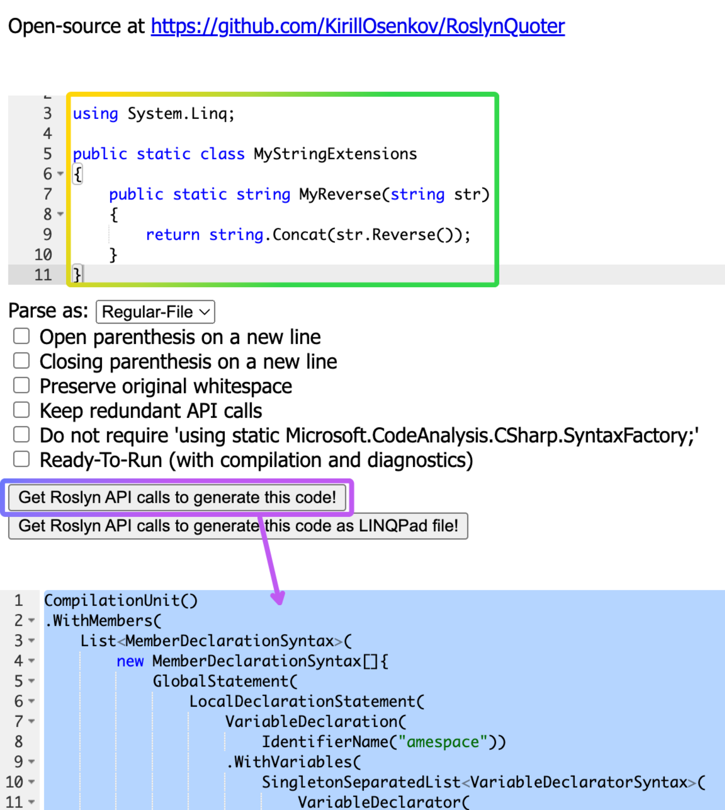

## Summary

We have discussed how we could use C# classes and methods offered by the Roslyn API, to create a CompilationUnit, which
is the
root node in a syntax tree that represents a C# file! and then used it to create a syntax tree and compile it to an
assembly!

Then we introduced two tools, [SharpLab](https://sharplab.io/)
and [Roslyn Quoter](https://roslynquoter.azurewebsites.net/)

## Resources:

* [Sharp Lab](https://sharplab.io/)
* [Roslyn Quoter](https://roslynquoter.azurewebsites.net/)
