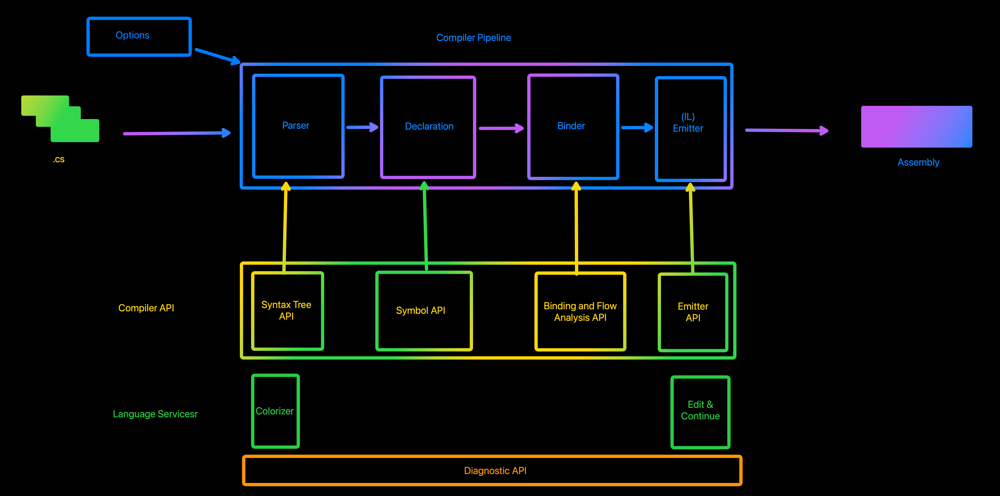

## Summary

We will discuss basics of compiler as a closed box, and how Roslyn opened this box. We will write a simple program and
by using APIs provided by Roslyn, we'll create a syntax tree, compiles it, and finally emitting an assembly for it. To
examine whether the compiled application works, we are loading the assembly and invoking the entry point!

## Resources:

* [The .NET Compiler Platform SDK](https://learn.microsoft.com/en-us/dotnet/csharp/roslyn-sdk/)
* [Understand the .NET Compiler Platform SDK model](https://learn.microsoft.com/en-us/dotnet/csharp/roslyn-sdk/compiler-api-model)
* [NuGet - Microsoft.CodeAnalysis.CSharp](https://www.nuget.org/packages/microsoft.codeanalysis.csharp/)
